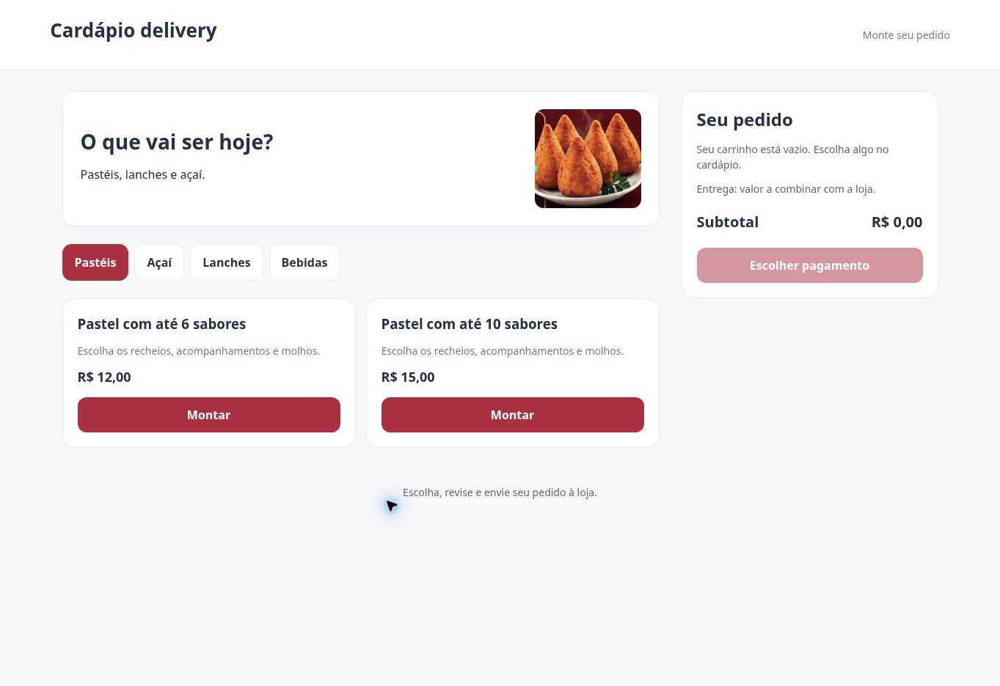
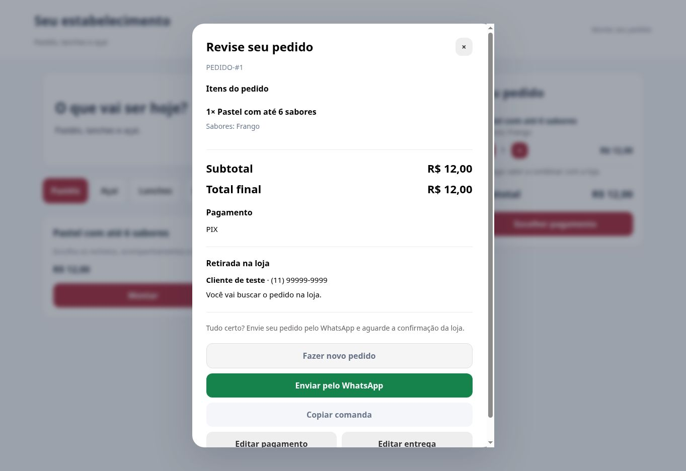

# Histórico de evolução do portal

Registro das decisões e entregas da primeira versão do projeto, para consultas futuras.

## Sobre este registro

- Data das etapas: **08/10/2026**.
- Horários: **Brasília (America/Sao_Paulo)**, conforme os pedidos da conversa.
- As etapas anteriores à publicação foram desenvolvidas e ajustadas em arquivos locais. Elas não correspondem a commits individuais no GitHub.
- Este histórico descreve o projeto sem incluir dados reais de clientes, contatos privados, credenciais ou informações internas do negócio.
- A publicação é uma versão em desenvolvimento, e não uma declaração de prontidão para operação comercial.

## Linha do tempo

| Horário de referência | Etapa | Resultado |
| --- | --- | --- |
| 10:29 | Protótipo inicial | Cardápio baseado nos produtos das referências fornecidas, carrinho, montagem de pastel e açaí, dados do cliente e endereço, revisão e comanda para WhatsApp. Identidade e contatos da loja não foram copiados. Itens riscados nas referências foram considerados indisponíveis. |
| 10:44 | Legibilidade da comanda | Texto em maiúsculas, sabores, acompanhamentos, molhos e observações em grupos separados. Inclusão de identificador de pedido, inicialmente longo e aleatório. |
| 10:55 | Estrutura de produção e pagamento | Remoção dos preços por item na comanda; valores concentrados no subtotal. Cabeçalho com identificação, data, hora, nome e telefone do cliente. Pagamento e endereço no rodapé. Inclusão de PIX, crédito, débito e dinheiro com necessidade de troco e valor informado. |
| 10:55 | Identificação simplificada | Substituição do identificador longo por numeração como `PEDIDO-#1`, sequencial no navegador. O código e a data permanecem ao revisar o mesmo pedido. |
| 11:02 | Referência visual de comanda | Resumo compacto, separadores entre produtos e grupos em linhas próprias. Não foi incluído acompanhamento de pedido. |
| 11:14 | Experiência do cliente | Interface suavizada; pagamento com elementos visuais; bloqueio das escolhas restantes ao atingir o limite, com contador e desbloqueio ao desmarcar. Repetições contam no limite do pastel. Telefone com máscara e validação de DDD de dois dígitos e celular de nove dígitos. |
| 11:14 | Checkout | Substituição da prévia da comanda por resumo de checkout para o cliente. A comanda em maiúsculas continua sendo gerada para envio à loja. |
| 11:24 | Preparação para web | Arquivo de entrada renomeado para `index.html`. Configuração de nome e WhatsApp removida da interface pública e mantida no código. Destinatário fixo deixado vazio para testes. |
| 11:28 | Entrega ou retirada | Dados começam com nome, telefone e escolha de recebimento. Endereço aparece e é obrigatório apenas para entrega. Retirada é identificada no checkout e na comanda, sem taxa de entrega. |
| 11:36 | Repositório e documentação | Envio do portal para o GitHub, README principal, regras em documento separado e arquivo `.nojekyll`. README com seção explícita de link para as regras. |
| Após 11:44 | Publicação | GitHub Pages ativado a partir da branch `main`, pasta raiz, com HTTPS. Publicação concluída com sucesso e portal aberto para verificação. |
| 11:48 | Registro de evolução | Inclusão deste histórico e link no README principal. |

## Publicação e evidências

- Repositório: [menu_lanchonete](https://github.com/eubruno-coder/menu_lanchonete).
- Portal: [Cardápio delivery](https://eubruno-coder.github.io/menu_lanchonete/).
- Primeira publicação: [execução do GitHub Pages](https://github.com/eubruno-coder/menu_lanchonete/actions/runs/37794973266), concluída com sucesso.
- Fonte da publicação: `main`, pasta `/ (root)`.

### Commits da primeira entrega

| Entrega | Commit |
| --- | --- |
| Portal em `index.html` | [d01039b](https://github.com/eubruno-coder/menu_lanchonete/commit/d01039b77fdb23d17275b45a0c6ee3d9d5c03fdc) |
| README principal | [3e45e34](https://github.com/eubruno-coder/menu_lanchonete/commit/3e45e3413854673595ee0d5542f15c1ef83d6695) |
| Regras do repositório | [e6ce7ae](https://github.com/eubruno-coder/menu_lanchonete/commit/e6ce7ae24bf97b46fa0f254f048cb8f9240d38b4) |
| Arquivo `.nojekyll` | [b0120ba](https://github.com/eubruno-coder/menu_lanchonete/commit/b0120ba67d058a509621b06eb155022b3454cc6a) |

## Decisões mantidas nesta versão

1. **Escopo inicial:** cardápio, personalização, carrinho, pagamento informado, entrega ou retirada e encaminhamento ao WhatsApp.
2. **Leitura da cozinha:** comanda em maiúsculas, sem preços por produto, com separação dos ingredientes e observações.
3. **Leitura do cliente:** checkout com resumo de itens, subtotal, pagamento e recebimento; sem exposição da comanda operacional.
4. **Pagamento:** o site registra a escolha, mas não realiza cobrança, transação PIX ou processamento de cartão.
5. **WhatsApp:** o cliente confirma o envio no aplicativo. Abrir o WhatsApp não confirma que a mensagem foi enviada ou que a loja aceitou o pedido.
6. **Configuração:** a versão publicada possui nome genérico e nenhum telefone fixo de destino. Nome e número podem ser definidos no código, sem menu público de configuração.
7. **Dados:** não há banco de dados ou armazenamento central de pedidos. Os dados preenchidos pelo cliente compõem a mensagem enviada pelo WhatsApp.
8. **Entrega:** taxa a combinar com a loja; subtotal representa os produtos. Na retirada, não há taxa de entrega.
9. **Documentação:** apresentação no README principal, regras em arquivo próprio e evolução neste documento.

## Validações realizadas e limites

Durante os ajustes locais foram verificadas a sintaxe JavaScript e as regras de formatação da comanda, valores, pagamentos, troco, numeração, limites de seleção, repetições e máscara de telefone. Essas verificações não substituem testes completos em todos os navegadores.

Após a publicação foram conferidos no navegador o carregamento do cardápio, montagem de pastel, inclusão no carrinho, tela de pagamento e tela de dados com entrega ou retirada. Não houve envio de pedido real à loja nem teste de processamento de pagamento.

### Limitações conhecidas

- Numeração sequencial local ao navegador; pode repetir entre clientes, dispositivos ou após limpeza do armazenamento. Não garante exclusividade global nem coordenação entre abas.
- Nome e número de destino no código de uma página estática são públicos; essa configuração não é um backend sigiloso.
- Dados e carrinho não possuem persistência central. Recarregar a página interrompe o fluxo de pedido.
- O comportamento de compartilhamento sem destinatário fixo depende do WhatsApp, do navegador e do dispositivo.
- Não existe confirmação automática de recebimento ou envio, painel de cozinha, gestão ou rastreamento de pedido.
- O repositório é público. O documento de regras registra restrições de uso; não impede tecnicamente a visualização ou cópia.

## Possibilidades futuras, ainda não implementadas

- Gestão centralizada de pedidos e numeração única.
- Painel operacional para atendimento e cozinha.
- Acompanhamento de status de pedido.
- Configuração de lojas e evolução para um produto SaaS.
- Integrações adicionais, condicionadas a requisitos e validações futuros.

Essas possibilidades foram discutidas como evolução futura e não representam funcionalidades entregues ou prazo assumido.

## Como atualizar este histórico

Em futuras alterações, acrescentar uma etapa com data, objetivo, resultado, decisões, validações, limitações e links dos commits relevantes. Preservar os registros anteriores e distinguir planos de funcionalidades efetivamente publicadas. Não incluir dados pessoais ou sigilosos.

## Evolução após a primeira publicação — 08/10/2026, solicitação às 11:59

- Identidade da loja movida para `config/estabelecimento.json`, com nome, descrição, logo, cor principal e WhatsApp. Nome provisório enquanto o responsável não informa a identidade definitiva.
- Logo prevista ao lado do nome no cabeçalho. Comanda usa o nome carregado da configuração.
- Retirada apresenta total final igual ao subtotal, sem a expressão “sem taxa de entrega”. Entrega mantém confirmação da taxa e do total pela loja.
- Sequência local preservada na chave anterior. UUID interno e snapshot versão 1 adicionados; recarregar a mesma aba recupera o pedido. Novo pedido cria outra identidade sem apagar o registro anterior.
- Dados pessoais passam a ser persistidos localmente para recuperação; README e interface atualizados para refletir essa mudança. Não existe backup ou persistência central.
- Contrato de migração e estados futuros registrados em [Configuração e integração](CONFIGURACAO_E_INTEGRACAO.md). Recebido, preparando e pronto (retirada/saindo para entrega) são planejamento, não um painel implementado.
- Verificados em código: identidade externa, total de retirada, estabilidade do código na alocação e persistência do snapshot. Limitações anteriores sobre ausência de snapshots descrevem a primeira versão e são substituídas nesta etapa; a numeração continua local e não exclusiva entre dispositivos.

### Verificação da atualização publicada

A publicação da etapa foi concluída com sucesso. Em teste com dados fictícios no navegador, foram conferidos o nome carregado do JSON, o pedido de pastel, pagamento PIX e retirada com total final igual ao subtotal. Após recarregar a mesma aba, carrinho, dados, pagamento, retirada e `PEDIDO-#1` foram recuperados sem nova numeração. Nenhuma mensagem foi enviada à loja. A numeração observada pertence ao navegador de teste, não a uma sequência global.

## Registro visual — 08/10/2026

Capturas originais preservadas para consulta da evolução do portal. Elas retratam as versões nas etapas indicadas e não necessariamente a aparência atual. O checkout utiliza exclusivamente dados fictícios de teste; não houve envio de pedido real.

### Primeira publicação do portal

Cardápio publicado com identidade genérica, categorias de produtos, montagem de pastel e carrinho lateral.

### Checkout de retirada após a atualização

Identidade provisória carregada da configuração externa e revisão de um pedido de teste com pagamento PIX. Na retirada, subtotal e total final são iguais, sem a expressão “sem taxa de entrega”. O código exibido pertence ao navegador de teste.

As imagens estão versionadas em `docs/imagens/` junto ao histórico, sem depender dos arquivos temporários da conversa.
